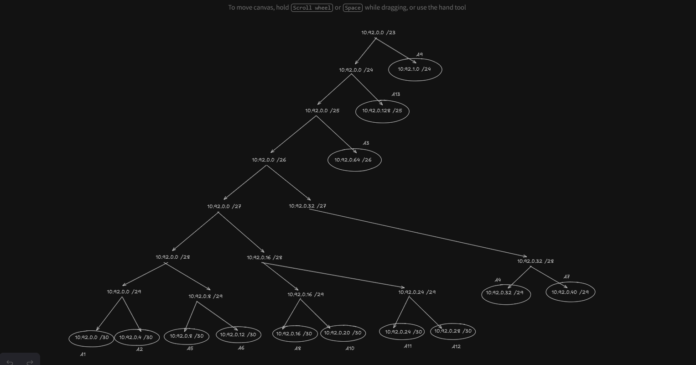
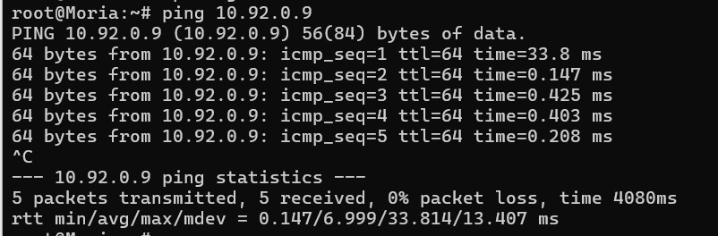
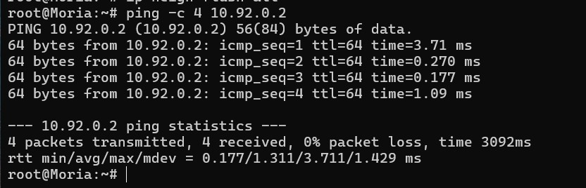
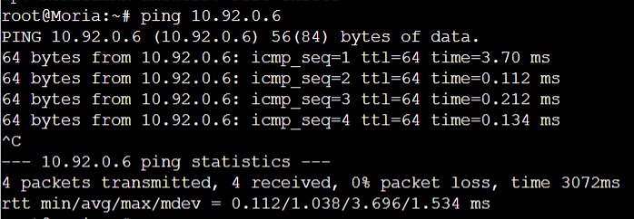

# Jarkom-Modul-5-2025-K57

| No | Nama Lengkap         | NRP        |
|----|----------------------|------------|
| 1  | Prabaswara Febrian   | 5027241069 |
| 2  | Erlinda Annisa Zahra | 5027241108 |

### Topologi

### Tabel Rute
| Nama Subnet | Rute                                                     | Jumlah IP | Netmask |
|-------------|-----------------------------------------------------------|-----------|---------|
| A1          | Osgiliath > Moria > Switch2 > IronHills                  | 2         | /30     |
| A2          | Osgiliath > Moria > Wilderland                           | 2         | /30     |
| A3          | Osgiliath > Moria > Wilderland > Durin                   | 51        | /26     |
| A4          | Osgiliath > Moria > Wilderland > Switch3 > Khamul        | 6         | /29     |
| A5          | Osgiliath > Moria                                        | 2         | /30     |
| A6          | Osgiliath > Rivendell                                    | 2         | /30     |
| A7          | Osgiliath > Rivendell > Switch1 > Vilya, Narya           | 3         | /29     |
| A8          | Osgiliath > Minastir                                     | 2         | /30     |
| A9          | Osgiliath > Minastir > Switch4 > Elendil                 | 231       | /24     |
| A10         | Osgiliath > Minastir > Pelargir                          | 2         | /30     |
| A11         | Osgiliath > Minastir > Pelargir > Palantir               | 2         | /30     |
| A12         | Osgiliath > Minastir > AnduinBanks                       | 2         | /30     |
| A13         | Osgiliath > Minastir > AnduinBanks > Switch5 > Gilgalad, Cirdan | 121 | /25     |
| **Total**   | —                                                         | **428**   | **/23** |

### VLSM Tree

### Tabel Networking (VLSM)

| Subnet | Network ID  | Netmask           | Broadcast   | Range IP                     | CIDR |
|--------|-------------|-------------------|-------------|------------------------------|------|
| A1     | 10.92.0.0   | 255.255.255.252   | 10.92.0.3   | 10.92.0.1 – 10.92.0.2        | /30  |
| A2     | 10.92.0.4   | 255.255.255.252   | 10.92.0.7   | 10.92.0.5 – 10.92.0.6        | /30  |
| A3     | 10.92.0.64  | 255.255.255.192   | 10.92.0.127 | 10.92.0.65 – 10.92.0.126     | /26  |
| A4     | 10.92.0.32  | 255.255.255.248   | 10.92.0.39  | 10.92.0.33 – 10.92.0.38      | /29  |
| A5     | 10.92.0.8   | 255.255.255.252   | 10.92.0.11  | 10.92.0.9 – 10.92.0.10       | /30  |
| A6     | 10.92.0.12  | 255.255.255.252   | 10.92.0.15  | 10.92.0.13 – 10.92.0.14      | /30  |
| A7     | 10.92.0.40  | 255.255.255.248   | 10.92.0.47  | 10.92.0.41 – 10.92.0.46      | /29  |
| A8     | 10.92.0.16  | 255.255.255.252   | 10.92.0.19  | 10.92.0.17 – 10.92.0.18      | /30  |
| A9     | 10.92.0.0   | 255.255.255.0     | 10.92.1.255 | 10.92.1.0 – 10.92.1.254      | /24  |
| A10    | 10.92.0.20  | 255.255.255.252   | 10.92.0.23  | 10.92.0.21 – 10.92.0.22      | /30  |
| A11    | 10.92.0.24  | 255.255.255.252   | 10.92.0.27  | 10.92.0.25 – 10.92.0.26      | /30  |
| A12    | 10.92.0.28  | 255.255.255.252   | 10.92.0.31  | 10.92.0.29 – 10.92.0.30      | /30  |
| A13    | 10.92.0.128 | 255.255.255.128   | 10.92.0.255 | 10.92.0.129 – 10.92.0.254    | /25  |

### Tabel IP Address

| Unit        | IP           | Subnet |
|-------------|--------------|--------|
| Moria       | 10.92.0.1    | A1     |
| IronHills   | 10.92.0.2    | A1     |
| Moria       | 10.92.0.5    | A2     |
| Wilderland  | 10.92.0.6    | A2     |
| Wilderland  | 10.92.0.65   | A3     |
| Durin       | 10.92.0.66   | A3     |
| Wilderland  | 10.92.0.33   | A4     |
| Khamul      | 10.92.0.34   | A4     |
| Osgiliath   | 10.92.0.9    | A5     |
| Moria       | 10.92.0.10   | A5     |
| Osgiliath   | 10.92.0.13   | A6     |
| Rivendell   | 10.92.0.14   | A6     |
| Rivendell   | 10.92.0.41   | A7     |
| Vilya       | 10.92.0.42   | A7     |
| Narya       | 10.92.0.43   | A7     |
| Osgiliath   | 10.92.0.17   | A8     |
| Minastir    | 10.92.0.18   | A8     |
| Minastir    | 10.92.1.1    | A9     |
| Elendil     | 10.92.1.2    | A9     |
| Isildur     | 10.92.1.3    | A9     |
| Minastir    | 10.92.0.21   | A10    |
| Pelargir    | 10.92.0.22   | A10    |
| Pelargir    | 10.92.0.25   | A11    |
| Palantir    | 10.92.0.26   | A11    |
| Pelargir    | 10.92.0.29   | A12    |
| Palantir    | 10.92.0.30   | A12    |
| AnduinBanks | 10.92.0.129  | A13    |
| Gilgalad    | 10.92.0.130  | A13    |
| Cirdan      | 10.92.0.131  | A13    |

## Misi 1
Mengidentifikasi perangkat, setelah itu membagi IP menggunakan VLSM dengan tree lalu membuat konfigurasi rute agar terhubung.

#### Moria

    cat << EOF > /etc/network/interfaces
    auto lo
    iface lo inet loopback

    auto eth2
    iface eth2 inet static
        address 10.92.0.1
        netmask 255.255.255.252

    auto eth1
    iface eth1 inet static
        address 10.92.0.5
        netmask 255.255.255.252

    auto eth0
    iface eth0 inet static
        address 10.92.0.10
        netmask 255.255.255.252
    EOF

#### Wilderland

        cat << EOF > /etc/network/interfaces
        auto lo
        iface lo inet loopback

        auto eth0
        iface eth0 inet static
            address 10.92.0.6
            netmask 255.255.255.252

        auto eth1
        iface eth1 inet static
            address 10.92.0.65
            netmask 255.255.255.192

        auto eth2
        iface eth2 inet static
            address 10.92.0.33
            netmask 255.255.255.248
        EOF

#### Osgiliath

        cat << EOF > /etc/network/interfaces
        auto lo
        iface lo inet loopback

        auto eth0
        iface eth0 inet dhcp

        auto eth1
        iface eth1 inet static
        address 10.92.0.13
        netmask 255.255.255.252

        auto eth2
        iface eth2 inet static
        address 10.92.0.9
        netmask 255.255.255.252

        auto eth3
        iface eth3 inet static
            address 10.92.0.17
            netmask 255.255.255.252
        EOF

#### Rivendell

        cat << EOF > /etc/network/interfaces
        auto lo
        iface lo inet loopback

        auto eth0
        iface eth0 inet static
            address 10.92.0.14
            netmask 255.255.255.252

        auto eth1
        iface eth1 inet static
            address 10.92.0.41
            netmask 255.255.255.248
        EOF

#### Vilya

        cat << EOF > /etc/network/interfaces
        auto lo
        iface lo inet loopback

        auto eth0
        iface eth0 inet static
            address 10.92.0.42
            netmask 255.255.255.248
        EOF

#### Narya

        cat << EOF > /etc/network/interfaces
        auto lo
        iface lo inet loopback

        auto eth0
        iface eth0 inet static
            address 10.92.0.43
            netmask 255.255.255.248
        EOF

#### Minastir

        cat << EOF > /etc/network/interfaces
        auto lo
        iface lo inet loopback

        auto eth0
        iface eth0 inet static
            address 10.92.0.18
            netmask 255.255.255.252

        auto eth1
        iface eth1 inet static
            address 10.92.1.1
            netmask 255.255.255.0

        auto eth2
        iface eth2 inet static
            address 10.92.0.21
            netmask 255.255.255.252

#### Pelargir

        cat << EOF > /etc/network/interfaces
        auto lo
        iface lo inet loopback

        auto eth0
        iface eth0 inet static
            address 10.92.0.22
            netmask 255.255.255.252

        auto eth1
        iface eth1 inet static
            address 10.92.0.29
            netmask 255.255.255.252

        auto eth2
        iface eth2 inet static
            address 10.92.0.25
            netmask 255.255.255.252
        EOF

#### Palantir 

        cat << EOF > /etc/network/interfaces
        auto lo
        iface lo inet loopback
        
        auto eth0
        iface eth0 inet static
            address 10.92.0.26
            netmask 255.255.255.252
        EOF

#### Anduinbanks

        cat << EOF > /etc/network/interfaces
        auto lo
        iface lo inet loopback

        auto eth0
        iface eth0 inet static
            address 10.92.0.30
            netmask 255.255.255.252

        auto eth1
        iface eth1 inet static
            address 10.92.0.129
            netmask 255.255.255.128
        EOF

#### IronHills

        cat << EOF > /etc/network/interfaces
        auto lo
        iface lo inet loopback
        
        auto eth0
        iface eth0 inet static
            address 10.92.0.2
            netmask 255.255.255.252
        EOF

#### Dynamic IP untuk client
Hanya untuk Durin,Khamul,Elendil,Isildur,Gilgalad dan Cirdan.

        cat << EOF > /etc/network/interfaces
        auto lo
        iface lo inet loopback

        auto eth0
        iface eth0 inet dhcp
        EOF

### Routing 

#### Moria

                # A3
                route add -net 10.92.0.64 netmask 255.255.255.192 gw 10.92.0.6

                # A4
                route add -net 10.92.0.32 netmask 255.255.255.248 gw 10.92.0.6

                # A6–A13 → semua ke Osgiliath
                route add -net 10.92.0.12 netmask 255.255.255.252 gw 10.92.0.9
                route add -net 10.92.0.16 netmask 255.255.255.252 gw 10.92.0.9
                route add -net 10.92.1.0 netmask 255.255.255.0 gw 10.92.0.9
                route add -net 10.92.0.20 netmask 255.255.255.252 gw 10.92.0.9
                route add -net 10.92.0.24 netmask 255.255.255.252 gw 10.92.0.9
                route add -net 10.92.0.28 netmask 255.255.255.252 gw 10.92.0.9
                route add -net 10.92.0.128 netmask 255.255.255.128 gw 10.92.0.9

                # Default untuk ke Internet
                route add -net 0.0.0.0 netmask 0.0.0.0 gw 10.92.0.9

#### Wilderland

                # A1
                route add -net 10.92.0.0 netmask 255.255.255.252 gw 10.92.0.5

                # A5–A13
                route add -net 10.92.0.8 netmask 255.255.255.252 gw 10.92.0.5
                route add -net 10.92.0.12 netmask 255.255.255.252 gw 10.92.0.5
                route add -net 10.92.0.16 netmask 255.255.255.252 gw 10.92.0.5
                route add -net 10.92.1.0 netmask 255.255.255.0 gw 10.92.0.5
                route add -net 10.92.0.20 netmask 255.255.255.252 gw 10.92.0.5
                route add -net 10.92.0.24 netmask 255.255.255.252 gw 10.92.0.5
                route add -net 10.92.0.28 netmask 255.255.255.252 gw 10.92.0.5
                route add -net 10.92.0.128 netmask 255.255.255.128 gw 10.92.0.5

#### Osgiliath

                # Ke A1–A4 via Moria
                route add -net 10.92.0.0 netmask 255.255.255.252 gw 10.92.0.10
                route add -net 10.92.0.4 netmask 255.255.255.252 gw 10.92.0.10
                route add -net 10.92.0.64 netmask 255.255.255.192 gw 10.92.0.10
                route add -net 10.92.0.32 netmask 255.255.255.248 gw 10.92.0.10

                # Ke A7 via Rivendell
                route add -net 10.92.0.40 netmask 255.255.255.248 gw 10.92.0.14

                # Ke A9–A13 via Minastir
                route add -net 10.92.1.0 netmask 255.255.255.0 gw 10.92.0.18
                route add -net 10.92.0.20 netmask 255.255.255.252 gw 10.92.0.18
                route add -net 10.92.0.24 netmask 255.255.255.252 gw 10.92.0.18
                route add -net 10.92.0.28 netmask 255.255.255.252 gw 10.92.0.18
                route add -net 10.92.0.128 netmask 255.255.255.128 gw 10.92.0.18

#### Rivendell

                # Semua subnet yang bukan A6/A7:

                route add -net 10.92.0.0 netmask 255.255.255.252 gw 10.92.0.13
                route add -net 10.92.0.4 netmask 255.255.255.252 gw 10.92.0.13
                route add -net 10.92.0.8 netmask 255.255.255.252 gw 10.92.0.13
                route add -net 10.92.0.16 netmask 255.255.255.252 gw 10.92.0.13
                route add -net 10.92.1.0 netmask 255.255.255.0 gw 10.92.0.13
                route add -net 10.92.0.20 netmask 255.255.255.252 gw 10.92.0.13
                route add -net 10.92.0.24 netmask 255.255.255.252 gw 10.92.0.13
                route add -net 10.92.0.28 netmask 255.255.255.252 gw 10.92.0.13
                route add -net 10.92.0.128 netmask 255.255.255.128 gw 10.92.0.13

#### Minastir

                # Ke A1–A7 via Osgiliath
                route add -net 10.92.0.0 netmask 255.255.255.252 gw 10.92.0.17
                route add -net 10.92.0.4 netmask 255.255.255.252 gw 10.92.0.17
                route add -net 10.92.0.8 netmask 255.255.255.252 gw 10.92.0.17
                route add -net 10.92.0.12 netmask 255.255.255.252 gw 10.92.0.17
                route add -net 10.92.0.40 netmask 255.255.255.248 gw 10.92.0.17

                # Ke A11–A13 via Pelargir
                route add -net 10.92.0.24 netmask 255.255.255.252 gw 10.92.0.22
                route add -net 10.92.0.28 netmask 255.255.255.252 gw 10.92.0.22
                route add -net 10.92.0.128 netmask 255.255.255.128 gw 10.92.0.22

#### Pelargir

                # Ke A1–A9 via Minastir
                route add -net 10.92.0.0 netmask 255.255.255.252 gw 10.92.0.21
                route add -net 10.92.0.4 netmask 255.255.255.252 gw 10.92.0.21
                route add -net 10.92.0.8 netmask 255.255.255.252 gw 10.92.0.21
                route add -net 10.92.0.12 netmask 255.255.255.252 gw 10.92.0.21
                route add -net 10.92.0.16 netmask 255.255.255.252 gw 10.92.0.21
                route add -net 10.92.1.0 netmask 255.255.255.0 gw 10.92.0.21

                # Ke A13 via AnduinBanks
                route add -net 10.92.0.128 netmask 255.255.255.128 gw 10.92.0.30

#### Arduinbanks

                route add -net 0.0.0.0 netmask 0.0.0.0 gw 10.92.0.29

#### Dokumentasi

- Ping Moria Menuju Osgiliath

- Ping Moria Menuju IronHills

- Ping Moria Menuju Rivendell

- Ping Moria Menuju Wilderland

4. Konfigurasi Service

- Service 1 (DHCP server vilya)

Install DHCP Server di Vilya

        apt update
        apt install isc-dhcp-server -y

Set Interface DHCP server

        echo 'INTERFACESv4="eth0"' > /etc/default/isc-dhcp-server

Konfigurasi DHCP di (/etc/dhcp/dhcpd.conf)

        option domain-name-servers 10.92.0.43;

        # A3 - DURIN (50 host)
        subnet 10.92.0.64 netmask 255.255.255.192 {
            range 10.92.0.66 10.92.0.126;
            option routers 10.92.0.65;
        }

        # A4 - KHAMUL (5 host)
        subnet 10.92.0.32 netmask 255.255.255.248 {
            range 10.92.0.34 10.92.0.38;
            option routers 10.92.0.33;
        }

        # A9 - ELENDIL (200 host)
        subnet 10.92.1.0 netmask 255.255.255.0 {
            range 10.92.1.2 10.92.1.254;
            option routers 10.92.1.1;
        }

        # A10 - ISILDUR (30 hosts)
        subnet 10.92.0.20 netmask 255.255.255.252 {
            range 10.92.0.22 10.92.0.22;
            option routers 10.92.0.21;
        }

        # A13 - GILGALAD + CIRDDAN (100 + 20 hosts)
        subnet 10.92.0.128 netmask 255.255.255.128 {
            range 10.92.0.130 10.92.0.254;
            option routers 10.92.0.129;
        }

        # A7 subnet Vilya sendiri
        subnet 10.92.0.40 netmask 255.255.255.248 { }

Restart DHCP

        service isc-dhcp-server restart

- Service 2 (DHCP Relay)

Install DHCP Relay

        apt install isc-dhcp-relay -y

Edit dhcp relay

        nano /etc/default/isc-dhcp-relay

Diiisi Dengan

        SERVERS="10.92.0.42"
        INTERFACES="eth0 eth1 eth2"

Restart DHCP Relay

        service isc-dhcp-relay restart

- Service 3 (DNS Server Narya)

Install Bind9

        apt install bind9 -y

Edit dengan **nano /etc/bind/named.conf.options**

Dengan isi file 

        options {
            directory "/var/cache/bind";
            forwarders {
                8.8.8.8;
            };
            allow-query { any; };
            recursion yes;
            dnssec-validation no;
        };

Restart

        service bind9 restart

Melakukan Tes DNS dengan

        dig google.com

- Service 4 (Web Server)

Berada di palantir dan IronHills

Install Apache

        apt install apache2 -y

**Palantir**

        echo "Welcome to Palantir" > /var/www/html/index.html

**IronHills**

        echo "Welcome to IronHills" > /var/www/html/index.html

Restart

        service apache2 restart

Coba menjalankan dengan

        curl 10.92.0.26
        curl 10.92.0.2

- Service 5 (Client DHCP)

Membuat file 

        nano /etc/network/interfaces

Diisi Dengan

        auto eth0
        iface eth0 inet dhcp

Test dengan 

        ping google.com -c 2

## Misi 2

1. Agar jaringan Aliansi bisa terhubung ke luar (Valinor/Internet), konfigurasi routing menggunakan iptables. Syarat: Kalian TIDAK DIPERBOLEHKAN menggunakan target MASQUERADE. 

Di Osgiliath

        echo "net.ipv4.ip_forward=1" >> /etc/sysctl.conf
        sysctl -p

Buat iptables NAT

        iptables -t nat -A POSTROUTING -o nat0 -j SNAT --to-source 192.168.122.10

Izinkan paket dari internal menuju internet

        iptables -A FORWARD -i eth2 -o nat0 -j ACCEPT
        iptables -A FORWARD -i eth1 -o nat0 -j ACCEPT
        iptables -A FORWARD -i eth3 -o nat0 -j ACCEPT

Izinkan traffic balikan dari internet

        iptables -A FORWARD -i nat0 -m state --state RELATED,ESTABLISHED -j ACCEPT

2. Karena Vilya (DHCP) menyimpan data vital, pastikan tidak ada perangkat lain yang bisa melakukan PING ke Vilya. Namun, Vilya tetap leluasa dapat mengakses/ping ke seluruh perangkat lain. 

Block ping ke vilya dengan

        iptables -A INPUT -p icmp -j DROP

Testing 

        ping 10.92.0.42

Akan menghasilkan output Request time out.

Testing 

        ping 10.92.0.1
        ping 10.92.0.130
        ping 8.8.8.8

Harus Menghasilkan output ping.

3. Agar lokasi pasukan tidak bocor, hanya Vilya yang dapat mengakses Narya (DNS). Gunakan nc (netcat) untuk memastikan akses port DNS (53) ini. [Hapus aturan ini setelah pengujian agar internet lancar untuk install paket]

Iptables dijalankan di Narya lalu izinkan hanya vilya

        iptables -A INPUT -p tcp --dport 53 -s 10.92.0.42 -j ACCEPT
        iptables -A INPUT -p udp --dport 53 -s 10.92.0.42 -j ACCEPT

Setelah itu Drop Semua akses DNS

        iptables -A INPUT -p tcp --dport 53 -j DROP
        iptables -A INPUT -p udp --dport 53 -j DROP

Test menggunakan nc

        nc -vz 10.92.0.43 53

Output Harus bisa

        nc -vz 10.92.0.43 53

Output Harus Gagal

4. Aktivitas mencurigakan terdeteksi di IronHills. Berdasarkan dekrit Raja, IronHills hanya boleh diakses pada Akhir Pekan (Sabtu & Minggu). Akses hanya diizinkan untuk Faksi Kurcaci & Pengkhianat (Durin & Khamul) serta Faksi Manusia (Elendil & Isildur). Karena hari ini adalah Rabu (Simulasikan waktu server), mereka harusnya tertolak. Gunakan curl untuk membuktikan blokir waktu ini.

Lalu Run Di IronHills Server

        iptables -A INPUT -p tcp --dport 80 -j DROP

        iptables -A INPUT -p tcp --dport 80 -s 10.92.0.64/26 \
            -m time --weekdays Sat,Sun -j ACCEPT

        iptables -A INPUT -p tcp --dport 80 -s 10.92.0.32/29 \
            -m time --weekdays Sat,Sun -j ACCEPT

        iptables -A INPUT -p tcp --dport 80 -s 10.92.1.0/24 \
            -m time --weekdays Sat,Sun -j ACCEPT

        iptables -A INPUT -p tcp --dport 80 -s 10.92.0.20/30 \
            -m time --weekdays Sat,Sun -j ACCEPT

Test dari Durin **curl 10.92.0.2** hasilnya akan failed Connect

Jika ganti waktu ke sabtu **date -s "2025-11-15 12:00:00"** lalu di run kembali di durin dengan **curl 10.92.0.2** akan menghasilkan welcome to IronHills

5. Sembari menunggu, pasukan berlatih di server Palantir. Akses dibatasi berdasarkan ras: Faksi Elf (Gilgalad & Cirdan): Boleh akses jam 07.00 - 15.00. Faksi Manusia (Elendil & Isildur): Boleh akses jam 17.00 - 23.00. Gunakan curl untuk memastikan akses sesuai jam.

        # Drop Semua akses ke web
        iptables -A INPUT -p tcp --dport 80 -j DROP

        # Izinkan Faksi ELF: 07:00 - 15:00
        iptables -A INPUT -p tcp --dport 80 -s 10.92.0.128/25 \
            -m time --timestart 07:00 --timestop 15:00 -j ACCEPT

        # Izinkan Faksi Manusia (Elendil)
        iptables -A INPUT -p tcp --dport 80 -s 10.92.1.0/24 \
            -m time --timestart 17:00 --timestop 23:00 -j ACCEPT

        # Izinkan Faksi Manusia (Isildur)
        iptables -A INPUT -p tcp --dport 80 -s 10.92.0.20/30 \
            -m time --timestart 17:00 --timestop 23:00 -j ACCEPT

6. Pasukan Manusia (Elendil) diminta menguji keamanan Palantir. Lakukan simulasi port scan dengan nmap rentang port 1-100.

a. Web server harus memblokir scan port yang melebihi 15 port dalam waktu 20 detik.

b. Penyerang yang terblokir tidak dapat melakukan ping, nc, atau curl ke Palantir.

c. Catat log iptables dengan prefix 
"PORT_SCAN_DETECTED".

        # 1. Track all new TCP connection attempts to any port
        iptables -A INPUT -p tcp --dport 1:65535 \
            -m state --state NEW \
            -m recent --set --name portscan

        # 2. Detect if >15 ports scanned in 20 seconds
        iptables -A INPUT -p tcp --dport 1:65535 \
            -m state --state NEW \
            -m recent --update --seconds 20 --hitcount 15 --name portscan \
            -j LOG --log-prefix "PORT_SCAN_DETECTED "

        iptables -A INPUT -p tcp --dport 1:65535 \
            -m state --state NEW \
            -m recent --update --seconds 20 --hitcount 15 --name portscan \
            -j DROP

        # 3. If IP already marked as portscan, DROP all access
        iptables -A INPUT -m recent --rcheck --name portscan -j DROP

7. Hari Sabtu tiba. Akses ke IronHills dibatasi untuk mencegah overload. Akses ke IronHills hanya boleh berasal dari 3 koneksi aktif per IP dalam waktu bersamaan. Lakukan uji coba beban (stress test) menggunakan curl atau ab.

Izinkan Sampai 3 Koneksi Aktif per IP

        iptables -A INPUT -p tcp --syn --dport 80 \
            -m connlimit --connlimit-above 3 -j REJECT

ketika test menggunakan AB

        ab -n 20 -c 10 http://10.92.0.2/

Uji coba menggunakan curl

        curl 10.92.0.2
        curl 10.92.0.2
        curl 10.92.0.2

Akan berhasil jika lebih dari 4 akan di reject.

8. Selama uji coba, terdeteksi anomali. Setiap paket yang dikirim Vilya menuju Khamul, ternyata dibelokkan oleh sihir hitam menuju IronHills. Gunakan nc untuk memastikan alur pengalihan ini (Redirect trafik dari Client ke Server).

        iptables -t nat -A PREROUTING -s 10.92.0.42 -d 10.92.0.32/29 \
            -p tcp -j DNAT --to-destination 10.92.0.2

        iptables -t nat -A PREROUTING -s 10.92.0.42 -d 10.92.0.32/29 \
            -p udp -j DNAT --to-destination 10.92.0.2

## Misi 3

1. Penjara Barad-dûr: Mengetahui pengkhianatan Khamul, Aliansi mengambil langkah final: Blokir semua lalu lintas masuk dan keluar dari Khamul. Gunakan nc dan ping untuk membuktikan Khamul terisolasi total. Penting: Yang diblokir adalah Khamul (5 Host), BUKAN Durin (50 Host). Jangan sampai salah sasaran.

Block traffic keluar dari khamul dan Block traffic masuk ke Khamul.

        iptables -A FORWARD -s 10.92.0.32/29 -j DROP
        iptables -A FORWARD -d 10.92.0.32/29 -j DROP

Testing dari Khamul

        ping 10.92.0.5        # Moria
        ping 10.92.0.1        # IronHills
        curl 10.92.0.2        # IronHills Web
        nc -vz 10.92.0.9 80   # Osgiliath

Akan menghasilkan Destination Host Unreachable.

## Video Revisi

[Video Demo](https://youtu.be/VLsdHOoXXu0)